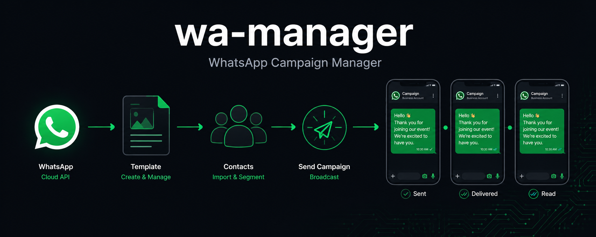

<div align="center">
  
</div>

<div align="center">

[](LICENSE)

</div>

---

Self-hostable WhatsApp campaign manager. Create templates, build contact groups, send personalized messages at scale, and track delivery in real time.

Built on the Meta WhatsApp Cloud API. Integrates with [go-invite-render](https://github.com/godopetza/go-invite-render) to attach rendered invitation cards to campaigns.

## Features

- **Template management** — create templates, submit to Meta for approval, sync status
- **Contact groups** — build lists manually or import via CSV
- **Campaigns** — pick a template + group, optionally attach an invitation card image, send
- **Delivery tracking** — real-time per-message status (sent → delivered → read) via webhooks
- **Self-hosted** — your data, your credentials, your Railway account

---

## Testing before you release

**Recommended order — do not skip this:**

### 1. Local test first (no credentials needed for the UI)

```sh
git clone https://github.com/godopetza/wa-manager
cd wa-manager
cp .env.example .env        # fill in META_* and JWT_SECRET + ADMIN_* only
docker compose up
```

Open `http://localhost:3000` → login with your `ADMIN_USERNAME` / `ADMIN_PASSWORD`.

You can test the entire UI — templates, groups, campaigns — without Meta credentials. Sending will fail gracefully (logged error, message marked `failed`) until you add real keys.

### 2. Test sending with real Meta credentials

Fill in the Meta vars in `.env`, then trigger a test campaign to a single group with just your own phone number. Confirm:
- [ ] Template appears in Meta dashboard
- [ ] Approval status syncs correctly
- [ ] Send fires a USSD/WhatsApp notification on your phone
- [ ] Delivery status updates to `delivered` then `read` in the History page

### 3. Deploy to Railway privately, test there

Once local works, deploy to Railway (see below) **before making the repo public**. Run the same single-contact test against the live Railway URL. Only after this passes should you mark the repo public.

### 4. Release

Tag `v0.1.0`, make public.

---

## Deploy to Railway

Railway hosts the backend (Go API) and frontend (Next.js) as separate services, with a managed PostgreSQL database — all in one project.

### Step 1 — Create a Railway project

1. Go to [railway.app](https://railway.com?referralCode=Szi12H) and create a new project
2. Click **New Service → GitHub Repo** → connect this repo
3. Set **Root Directory** to `backend` → Railway detects the Dockerfile automatically

### Step 2 — Add PostgreSQL (one click)

In the same Railway project:

1. Click **New Service → Database → PostgreSQL**
2. Railway creates the database and **automatically injects `DATABASE_URL`** into all services in the project
3. No manual connection string needed — the backend reads `DATABASE_URL` on startup and runs migrations automatically

### Step 3 — Set backend environment variables

In the backend service settings → Variables, add:

```
JWT_SECRET=<long random string>
ADMIN_USERNAME=admin
ADMIN_PASSWORD=<your password>
META_PHONE_NUMBER_ID=<from Meta dashboard>
META_ACCESS_TOKEN=<from Meta dashboard>
META_WABA_ID=<from Meta dashboard>
META_APP_ID=<from Meta dashboard>
META_APP_SECRET=<from Meta dashboard>
META_WEBHOOK_VERIFY_TOKEN=<any string you choose>
FRONTEND_URL=https://your-frontend.up.railway.app
```

`DATABASE_URL` and `PORT` are set automatically by Railway — do not add them manually.

### Step 4 — Add the frontend service

1. In the same Railway project, click **New Service → GitHub Repo** → same repo
2. Set **Root Directory** to `frontend`
3. Railway detects Next.js and builds it automatically (no Dockerfile needed — but one is included if you prefer)
4. Add one variable:
   ```
   NEXT_PUBLIC_API_URL=https://your-backend.up.railway.app
   ```
5. Set the frontend URL as `FRONTEND_URL` in the backend service (for CORS)

### Step 5 — Configure Meta webhook

In [Meta Developer Dashboard](https://developers.facebook.com) → your app → WhatsApp → Configuration:

- **Webhook URL**: `https://your-backend.up.railway.app/api/webhooks/whatsapp`
- **Verify token**: the value you set as `META_WEBHOOK_VERIFY_TOKEN`
- **Subscribe to**: `messages` (for delivery statuses)

---

## Cloudflare Workers (alternative frontend hosting)

If you prefer Cloudflare Workers for the frontend (same setup as production):

```sh
cd frontend
npm install
npx @cloudflare/next-on-pages     # build for Workers
npx wrangler pages deploy .vercel/output/static
```

Update `wrangler.toml` with your backend URL before deploying.

---

## Local development

```sh
cp .env.example .env
docker compose up
```

This starts:
- **PostgreSQL** on port 5432 (data persists in a Docker volume)
- **Backend** on port 8080 (auto-migrates database on startup)
- **Frontend** on port 3000

No manual database setup. Tables are created automatically on first boot.

To rebuild after code changes:
```sh
docker compose up --build
```

---

## go-invite-render integration

To attach a rendered invitation card to a campaign:

1. Deploy [go-invite-render](https://github.com/godopetza/go-invite-render) as a separate Railway service
2. Use its `POST /render` endpoint to generate a PNG for each guest
3. Host the PNG on any public URL (R2, S3, or the render service can return a public link)
4. When creating a campaign, paste the image URL into the **Invitation Card URL** field
5. wa-manager sends the PNG image to each contact **before** the template message

---

## API reference

All routes except `/health`, `/api/auth/login`, and `/api/webhooks/whatsapp` require:
```
Authorization: Bearer <jwt>
```

Get a JWT via `POST /api/auth/login` with `{"username": "...", "password": "..."}`.

| Method | Path | Description |
|---|---|---|
| POST | `/api/auth/login` | Get JWT |
| GET | `/api/templates` | List templates |
| POST | `/api/templates` | Create template |
| POST | `/api/templates/:id/submit` | Submit to Meta |
| POST | `/api/templates/:id/sync` | Pull status from Meta |
| POST | `/api/templates/:id/upload-image` | Upload header image to Meta |
| GET | `/api/groups` | List groups |
| POST | `/api/groups` | Create group |
| POST | `/api/groups/:id/contacts` | Add contact |
| POST | `/api/groups/:id/import` | Import CSV (phone, name columns) |
| GET | `/api/campaigns` | List campaigns |
| POST | `/api/campaigns` | Create campaign |
| POST | `/api/campaigns/:id/send` | Fire campaign |
| GET | `/api/campaigns/:id/messages` | Per-message delivery log |
| GET | `/api/webhooks/whatsapp` | Meta hub verify |
| POST | `/api/webhooks/whatsapp` | Delivery status updates |

---

## Used in production

Built and battle-tested at [shereko.com](https://shereko.com) — an event invitation and coordination platform for weddings and celebrations across East Africa. Shereko uses the WhatsApp Cloud API at scale to deliver personalized invitations and coordinate events with hundreds of guests per campaign.

---

## License

MIT
